# 哨兵二号（Sentinel-2）卫星数据处理

特别提醒：本文所有操作所需时间都很长，因此在自己电脑上操作的朋友记得将睡眠模式关闭。

## 一、数据下载

### 1. 打开网址：

* [USGS]([EarthExplorer (usgs.gov)](https://earthexplorer.usgs.gov/)) ；

### 2. 选择数据集：

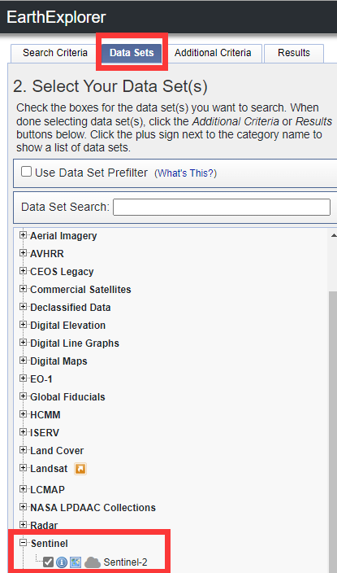

### 3. 选择地区：


* 点击最下方红框中的陕西省即可选择；
* 该步骤如果搜索不到国内的省份，要么是省份的英文写错了，要么是需要科学上网。

### 4. 选择日期和云度：


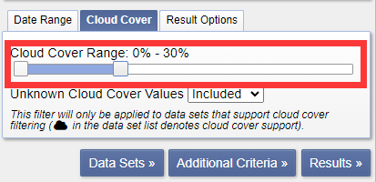

### 5. 选择其他参数（可选）：

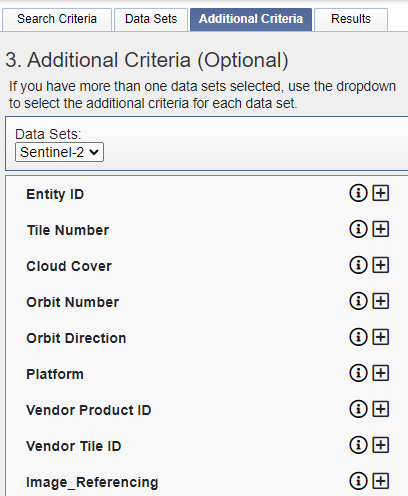

### 6. 生成结果：

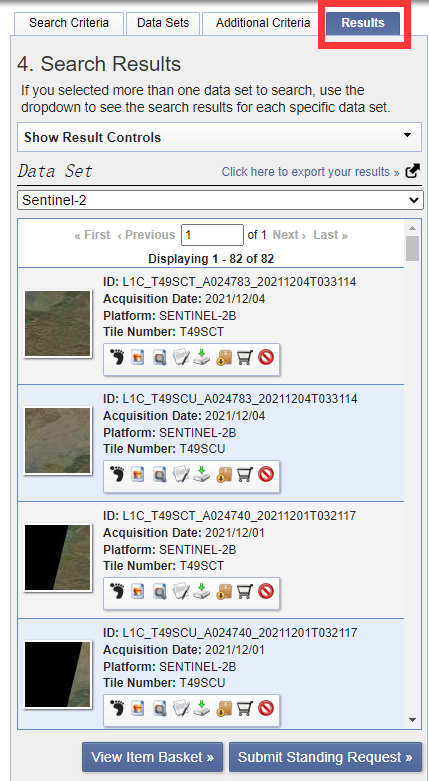

### 7. 选择图像：

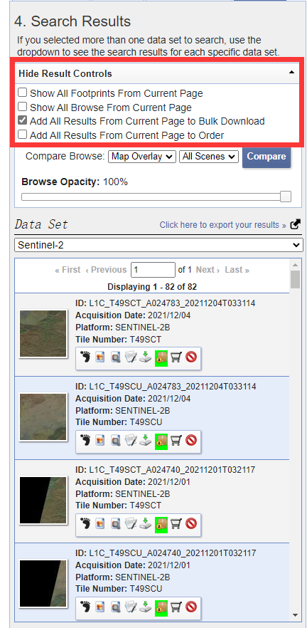

* 对每一页都做相同操作，可以看到图中的纸箱子 icon 变成了绿色，表示选定；

### 8. 生成下载链接：

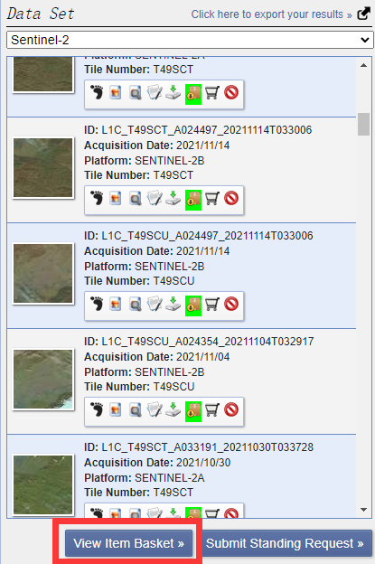

### 9. 安装下载器：


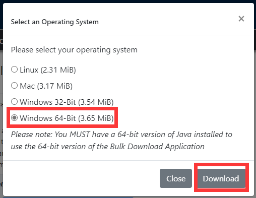

* 要安装该软件，还需要安装 java 10 64bit ，安装方法请自行百度；
* 配好 java 的环境变量后，就可以安装该软件了；

### 10. 提交下载链接：


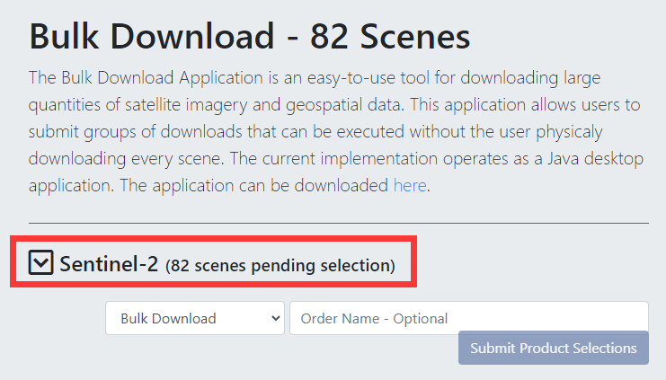

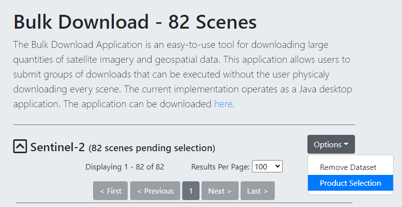

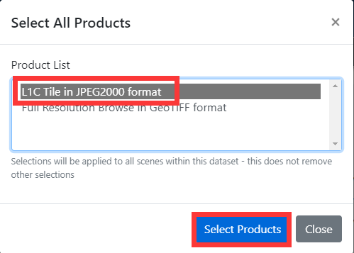


### 11. 通过软件下载：

* 打开 bda 软件；
* 登录账号；
* 在打开的 Open Order 窗口选择你的下载申请，若该窗口关闭，可在 File 菜单栏打开；
* 选择你的目标 order ；
* 点击 Begin Download 进行下载；
* 所下载的文件在 bda 软件的安装目录下；
* 一般晚上 1 点下载速度较快且连接稳定；
* 如果下载失败，出现了 error ，不要点击 Redownload ，该操作会删除下载失败的文件。此时应先下载完其他文件，最后重启 bda ，Select 错误的部分点击 Begin Download 即可继续下载；
* 当 error 发生后还有一种可行的方法就是不去管它，有时候 bda 软件会自动重新接续下载；
* 重启 bda 不成功，可能是因为它在后台运行，需要先打开资源管理器关闭它的进程。

## 二、数据介绍

## 1. 文件介绍

以 S2AMSIL1C20190122T025021N0208_R132T50RNV_20190122T065329.zip 为例：

1. S2A：表示 Sentinel-2A 卫星；
2. MSL：表示多光谱数据；
3. L1C：表示产品等级为 L1C 级别，该级别只经过了几何校正，L2A 级别产品还经过了辐射校正，但该级别需要用户自己处理；
4. 20190122T025021：表示数据获取时间，即 2019 年 1 月 22 日凌晨 2 点 50 分 21 秒，该时间为格林威治时间，比北京时间提前 8 个小时；
5. N0208_R132：处理基线编号与相对轨道编号；
6. T50RNV：拼接域编号；
7. 20190122T065329：估计是产品生成的时间；

## 2. 卫星介绍

|             |                     | S2A                     | S2A            | S2B                     | S2B            |                        |
| ----------- | ------------------- | ----------------------- | -------------- | ----------------------- | -------------- | ---------------------- |
| Band Number | Band name           | Central wavelength (nm) | Bandwidth (nm) | Central wavelength (nm) | Bandwidth (nm) | Spatial resolution (m) |
| 1           | Coastal aerosol     | 443.9                   | 27             | 442.3                   | 45             | 60                     |
| 2           | Blue                | 496.6                   | 98             | 492.1                   | 98             | 10                     |
| 3           | Green               | 560.0                   | 45             | 559                     | 46             | 10                     |
| 4           | Red                 | 664.5                   | 38             | 665                     | 39             | 10                     |
| 5           | Vegetation Red Edge | 703.9                   | 19             | 703.8                   | 20             | 20                     |
| 6           | Vegetation Red Edge | 740.2                   | 18             | 739.1                   | 18             | 20                     |
| 7           | Vegetation Red Edge | 782.5                   | 28             | 779.7                   | 28             | 20                     |
| 8           | NIR                 | 835.1                   | 145            | 833                     | 133            | 10                     |
| 8A          | Narrow NIR          | 864.8                   | 33             | 864                     | 32             | 20                     |
| 9           | Water vapour        | 945.0                   | 26             | 943.2                   | 27             | 60                     |
| 10          | SWIR – Cirrus       | 1373.5                  | 75             | 1376.9                  | 76             | 60                     |
| 11          | SWIR                | 1613.7                  | 143            | 1610.4                  | 141            | 20                     |
| 12          | SWIR                | 2202.4                  | 242            | 2185.7                  | 238            | 20                     |

## 三、数据显示与处理

### 1. 软件下载：

* 打开网址下载图像处理工具：[SNAP]([SNAP Download – STEP (esa.int)](http://step.esa.int/main/download/snap-download/)) ；
* 还需下载大气校正工具：[Sen2Cor]([Sen2Cor – STEP (esa.int)](http://step.esa.int/main/snap-supported-plugins/sen2cor/)) ；

### 2. 软件安装：

* SNAP 无脑下一步，需要 Python 环境的用户请注意软件支持的版本；
* Sen2Cor 加压即可，如果想要在任意文件夹下使用该工具，需要将其添加入系统环境变量；

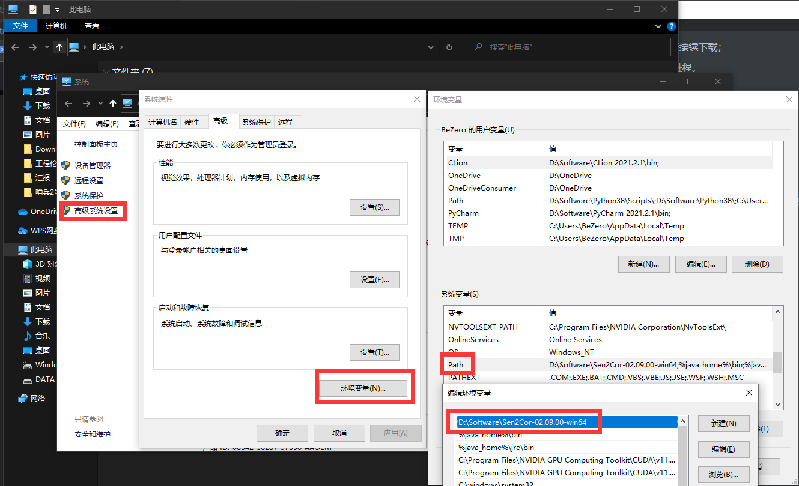

### 3. 大气校正：

* 将所有数据文件进行解压，放入一个单独的文件夹 Sentinel-2 中；
* 打开 cmd ；
* 进入 Sen2Cor 文件夹（如果添加了环境变量可跳过该步骤）；
* 输入命令：`for /D %s in (D:\Documentation\Project\Sentinel-2\S2A_MSIL1C*) do L2A_process --resolution=10 %s` ，其中 `--resolution=10` 表示处理分辨率为 10 的图像；`D:\Documentation\Project\Sentinel-2\S2A_MSIL1C*` 表示所下载的数据集的位置；
* 如果需要处理 S2B 星的数据，仅需要将上述操作中的 S2A_MSIL1C* 改为 S2B_MSIL1C* 即可。
* 等待系统处理即可；

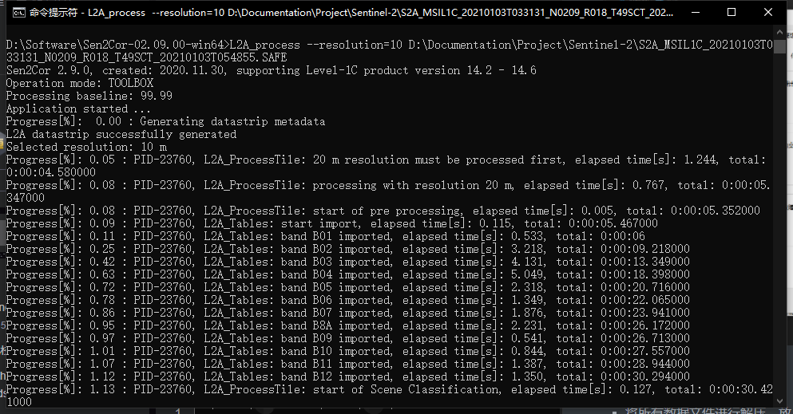

### 4. 导出 TIFF ：

* 创建一个 Python 环境；

* 下载 [gdal ](https://www.lfd.uci.edu/~gohlke/pythonlibs/#gdal) (注意版本须与 python 版本匹配);

* 将其放入你的 python 环境中的 Scripts 文件夹中（推荐使用虚拟环境）；

* 在 Terminal 中激活你的 python （通常是在同一目录下执行 activate.bat 文件）；

* 在 Terminal 中输入：`pip install GDAL-xxxxxx` ，注意是你自己的 GDAL 版本；

* 按需配置其他环境（例如 numpy 等）；

* 使用下述代码进行批处理：

  ```python
  from osgeo import gdal
  import os
  import numpy as np
  from osgeo import gdal, osr, ogr
  import glob
  # os.environ['CPL_ZIP_ENCODING'] = 'UTF-8'
  
  def S2tif(filename):
      # 打开栅格数据集
      print(filename)
      root_ds = gdal.Open(filename)
      # print(type(root_ds))
      # 返回结果是一个list，list中的每个元素是一个tuple，每个tuple中包含了对数据集的路径，元数据等的描述信息
      # tuple中的第一个元素描述的是数据子集的全路径
      ds_list = root_ds.GetSubDatasets()  # 获取子数据集。该数据以数据集形式存储且以子数据集形式组织
      visual_ds = gdal.Open(ds_list[0][0])  # 打开第1个数据子集的路径。ds_list有4个子集，内部前段是路径，后段是数据信息
      # print(visual_ds)
      print(f'打开数据为：{ds_list[0][1]}')
      # print(f'投影信息：{visual_ds.GetProjection()}')
      # print(f'栅格波段数：{visual_ds.RasterCount}')
      # print(f'栅格列数（宽度）：{visual_ds.RasterXSize}')
      # print(f'栅格行数（高度）：{visual_ds.RasterYSize}')
      visual_arr = visual_ds.ReadAsArray()  # 将数据集中的数据读取为ndarray
  
      # 创建.tif文件
      band_count = visual_ds.RasterCount  # 波段数
      xsize = visual_ds.RasterXSize
      ysize = visual_ds.RasterYSize
      out_tif_name = filename.split(".SAFE")[0] + ".tif"
      driver = gdal.GetDriverByName("GTiff")
      out_tif = driver.Create(out_tif_name, xsize, ysize, band_count, gdal.GDT_Float32)
      out_tif.SetProjection(visual_ds.GetProjection())  # 设置投影坐标
      out_tif.SetGeoTransform(visual_ds.GetGeoTransform())
  
      for index, band in enumerate(visual_arr):
          band = np.array([band])
          for i in range(len(band[:])):
              # 数据写出
              out_tif.GetRasterBand(index + 1).WriteArray(band[i])  # 将每个波段的数据写入内存，此时没有写入硬盘
      out_tif.FlushCache()  # 最终将数据写入硬盘
      out_tif = None  # 注意必须关闭tif文件
  
  if __name__ == "__main__":
      from osgeo import gdal
      SAFE_Path = (r'D:\Documentation\Project\Grassland ecology\Sentinel2_pretreatment\data')
      data_list = glob.glob(SAFE_Path + "\\*.SAFE")
  
      for i in range(len(data_list)):
          data_path = data_list[i]
          filename = data_path + "\\MTD_MSIL2A.xml"
          S2tif(filename)
          print(data_path + "-----转tif成功")
      print("----转换结束----")
  ```
  
* 代码中第 17 行是取第一个数据子集（band 2、3、4、8），要使用其他 band 须自行更改（第 18 行代码可以查看每个数据子集的信息）；

* 由于读取子数据集时，gdal 工具会将波段进行重组，导致波段的顺序与原数据集（sentinel-2 原始数据集）的波段顺序不同，因此可以通过 `gdalinfo [文件名或子数据集名]` 来获取重组后波段的顺序结构，方法如下：

  * 首先，打开并进入你所下载的 gdal 文件夹下的 `Lib\site-packages\osgeo` 目录；

  * 该目录下检查是否有一个 `gdalinfo.exe` 程序；

  * 在该目录下打开 cmd 命令行；

  * 输入 `gdalinfo xxx/xxx.xml` 查看数据信息，下面给出一个具体的例子以供参考：

    ```python
    $ gdalinfo S2A_MSIL2A_20210202T032941_N9999_R018_T49SCT_20211210T131028.SAFE/MTD_MSIL2A.xml
    # 上面这行是我的输入，其中数据文件夹为 S2A_MSIL2A_20210202T032941_N9999_R018_T49SCT_20211210T131028.SAFE
    # 由于 gdalinfo 不能直接读取 S2A 的文件，因此应该读取 xml 文件：/MTD_MSIL2A.xml
    # 程序支持写入相对或绝对路径，此处我是将数据文件放入了该目录下进行读取
    # 下面是文件信息的输出：
    Driver: SENTINEL2/Sentinel 2
    Files: S2A_MSIL2A_20210202T032941_N9999_R018_T49SCT_20211210T131028.SAFE/MTD_MSIL2A.xml
    Size is 512, 512
    Metadata:
      AOT_QUANTIFICATION_VALUE=1000.0
      AOT_QUANTIFICATION_VALUE_UNIT=none
      AOT_RETRIEVAL_ACCURACY=0.0
      BOA_QUANTIFICATION_VALUE=10000
      BOA_QUANTIFICATION_VALUE_UNIT=none
      CLOUD_COVERAGE_ASSESSMENT=1.049327
      CLOUD_SHADOW_PERCENTAGE=0.440092
      DARK_FEATURES_PERCENTAGE=30.990644
      DATATAKE_1_DATATAKE_SENSING_START=2021-02-02T03:29:41.024Z
      DATATAKE_1_DATATAKE_TYPE=INS-NOBS
      DATATAKE_1_ID=GS2A_20210202T032941_029330_N99.99
      DATATAKE_1_SENSING_ORBIT_DIRECTION=DESCENDING
      DATATAKE_1_SENSING_ORBIT_NUMBER=18
      DATATAKE_1_SPACECRAFT_NAME=Sentinel-2A
      DEGRADED_ANC_DATA_PERCENTAGE=0.0
      DEGRADED_MSI_DATA_PERCENTAGE=0
      FOOTPRINT=POLYGON((108.8262199395114 34.3223655300343, 110.01937756706981 34.3377366079947, 110.03062458149692 33.347577738129736, 108.85113286341723 33.3327671075422, 108.8262199395114 34.3223655300343))
      FORMAT_CORRECTNESS=PASSED
      GENERAL_QUALITY=PASSED
      GENERATION_TIME=2021-12-10T13:10:28.715000Z
      GEOMETRIC_QUALITY=PASSED
      HIGH_PROBA_CLOUDS_PERCENTAGE=0.061825
      MEDIUM_PROBA_CLOUDS_PERCENTAGE=0.484693
      NODATA_PIXEL_PERCENTAGE=0.000043
      NOT_VEGETATED_PERCENTAGE=47.824116
      PREVIEW_GEO_INFO=Not applicable
      PREVIEW_IMAGE_URL=Not applicable
      PROCESSING_BASELINE=99.99
      PROCESSING_LEVEL=Level-2A
      PRODUCT_START_TIME=2021-02-02T03:29:41.024Z
      PRODUCT_STOP_TIME=2021-02-02T03:29:41.024Z
      PRODUCT_TYPE=S2MSI2A
      PRODUCT_URI=S2A_MSIL2A_20210202T032941_N9999_R018_T49SCT_20211210T131028.SAFE
      RADIATIVE_TRANSFER_ACCURACY=0.0
      RADIOMETRIC_QUALITY=PASSED
      REFLECTANCE_CONVERSION_U=1.03080315559675
      SATURATED_DEFECTIVE_PIXEL_PERCENTAGE=0.000000
      SENSOR_QUALITY=PASSED
      SNOW_ICE_PERCENTAGE=0.002857
      SPECIAL_VALUE_NODATA=0
      SPECIAL_VALUE_SATURATED=65535
      THIN_CIRRUS_PERCENTAGE=0.502809
      UNCLASSIFIED_PERCENTAGE=10.570553
      VEGETATION_PERCENTAGE=6.625548
      WATER_PERCENTAGE=2.496857
      WATER_VAPOUR_RETRIEVAL_ACCURACY=0.0
      WVP_QUANTIFICATION_VALUE=1000.0
      WVP_QUANTIFICATION_VALUE_UNIT=cm
    Subdatasets:
      SUBDATASET_1_NAME=SENTINEL2_L2A:S2A_MSIL2A_20210202T032941_N9999_R018_T49SCT_20211210T131028.SAFE/MTD_MSIL2A.xml:10m:EPSG_32649
      SUBDATASET_1_DESC=Bands B2, B3, B4, B8 with 10m resolution, UTM 49N
     # 上述两行，第一行是子数据的位置信息，第二行是子数据的波段信息
        SUBDATASET_2_NAME=SENTINEL2_L2A:S2A_MSIL2A_20210202T032941_N9999_R018_T49SCT_20211210T131028.SAFE/MTD_MSIL2A.xml:20m:EPSG_32649
      SUBDATASET_2_DESC=Bands B5, B6, B7, B8A, B11, B12, AOT, CLD, SCL, SNW, WVP with 20m resolution, UTM 49N
      SUBDATASET_3_NAME=SENTINEL2_L2A:S2A_MSIL2A_20210202T032941_N9999_R018_T49SCT_20211210T131028.SAFE/MTD_MSIL2A.xml:60m:EPSG_32649
      SUBDATASET_3_DESC=Bands B1, B9, AOT, CLD, SCL, SNW, WVP with 60m resolution, UTM 49N
      SUBDATASET_4_NAME=SENTINEL2_L2A:S2A_MSIL2A_20210202T032941_N9999_R018_T49SCT_20211210T131028.SAFE/MTD_MSIL2A.xml:TCI:EPSG_32649
      SUBDATASET_4_DESC=True color image, UTM 49N
    Corner Coordinates:
    Upper Left  (    0.0,    0.0)
    Lower Left  (    0.0,  512.0)
    Upper Right (  512.0,    0.0)
    Lower Right (  512.0,  512.0)
    Center      (  256.0,  256.0)
    ```

    ```python
    $ gdalinfo SENTINEL2_L2A:S2A_MSIL2A_20210202T032941_N9999_R018_T49SCT_20211210T131028.SAFE/MTD_MSIL2A.xml:10m:EPSG_32649
    # 上面一行代码的作用是获取第一个子数据集的信息，子数据集的位置在上一节代码中有注释
    ERROR 1: PROJ: proj_create_from_database: Cannot find proj.db
    ERROR 1: PROJ: proj_create: no database context specified
    ERROR 1: PROJ: proj_create: no database context specified
    ERROR 1: PROJ: proj_create: no database context specified
    ERROR 1: PROJ: proj_create: no database context specified
    Driver: SENTINEL2/Sentinel 2
    Files: S2A_MSIL2A_20210202T032941_N9999_R018_T49SCT_20211210T131028.SAFE/MTD_MSIL2A.xml
           S2A_MSIL2A_20210202T032941_N9999_R018_T49SCT_20211210T131028.SAFE/GRANULE/L2A_T49SCT_A029330_20210202T032944/MTD_TL.xml
           S2A_MSIL2A_20210202T032941_N9999_R018_T49SCT_20211210T131028.SAFE/GRANULE/L2A_T49SCT_A029330_20210202T032944/IMG_DATA/R10m/T49SCT_20210202T032941_B04_10m.jp2
           S2A_MSIL2A_20210202T032941_N9999_R018_T49SCT_20211210T131028.SAFE/GRANULE/L2A_T49SCT_A029330_20210202T032944/IMG_DATA/R10m/T49SCT_20210202T032941_B03_10m.jp2
           S2A_MSIL2A_20210202T032941_N9999_R018_T49SCT_20211210T131028.SAFE/GRANULE/L2A_T49SCT_A029330_20210202T032944/IMG_DATA/R10m/T49SCT_20210202T032941_B02_10m.jp2
           S2A_MSIL2A_20210202T032941_N9999_R018_T49SCT_20211210T131028.SAFE/GRANULE/L2A_T49SCT_A029330_20210202T032944/IMG_DATA/R10m/T49SCT_20210202T032941_B08_10m.jp2
    # 上面的输出结果显示了波段重组后的信息
    Size is 10980, 10980
    Origin = (300000.000000000000000,3800040.000000000000000)
    Pixel Size = (10.000000000000000,-10.000000000000000)
    Metadata:
      AOT_QUANTIFICATION_VALUE=1000.0
      AOT_QUANTIFICATION_VALUE_UNIT=none
      AOT_RETRIEVAL_ACCURACY=0.0
      BOA_QUANTIFICATION_VALUE=10000
      BOA_QUANTIFICATION_VALUE_UNIT=none
      CLOUD_COVERAGE_ASSESSMENT=1.049327
      CLOUD_SHADOW_PERCENTAGE=0.440092
      DARK_FEATURES_PERCENTAGE=30.990644
      DATATAKE_1_DATATAKE_SENSING_START=2021-02-02T03:29:41.024Z
      DATATAKE_1_DATATAKE_TYPE=INS-NOBS
      DATATAKE_1_ID=GS2A_20210202T032941_029330_N99.99
      DATATAKE_1_SENSING_ORBIT_DIRECTION=DESCENDING
      DATATAKE_1_SENSING_ORBIT_NUMBER=18
      DATATAKE_1_SPACECRAFT_NAME=Sentinel-2A
      DEGRADED_ANC_DATA_PERCENTAGE=0.0
      DEGRADED_MSI_DATA_PERCENTAGE=0
      FORMAT_CORRECTNESS=PASSED
      GENERAL_QUALITY=PASSED
      GENERATION_TIME=2021-12-10T13:10:28.715000Z
      GEOMETRIC_QUALITY=PASSED
      HIGH_PROBA_CLOUDS_PERCENTAGE=0.061825
      MEDIUM_PROBA_CLOUDS_PERCENTAGE=0.484693
      NODATA_PIXEL_PERCENTAGE=0.000043
      NOT_VEGETATED_PERCENTAGE=47.824116
      PREVIEW_GEO_INFO=Not applicable
      PREVIEW_IMAGE_URL=Not applicable
      PROCESSING_BASELINE=99.99
      PROCESSING_LEVEL=Level-2A
      PRODUCT_START_TIME=2021-02-02T03:29:41.024Z
      PRODUCT_STOP_TIME=2021-02-02T03:29:41.024Z
      PRODUCT_TYPE=S2MSI2A
      PRODUCT_URI=S2A_MSIL2A_20210202T032941_N9999_R018_T49SCT_20211210T131028.SAFE
      RADIATIVE_TRANSFER_ACCURACY=0.0
      RADIOMETRIC_QUALITY=PASSED
      REFLECTANCE_CONVERSION_U=1.03080315559675
      SATURATED_DEFECTIVE_PIXEL_PERCENTAGE=0.000000
      SENSOR_QUALITY=PASSED
      SNOW_ICE_PERCENTAGE=0.002857
      SPECIAL_VALUE_NODATA=0
      SPECIAL_VALUE_SATURATED=65535
      THIN_CIRRUS_PERCENTAGE=0.502809
      UNCLASSIFIED_PERCENTAGE=10.570553
      VEGETATION_PERCENTAGE=6.625548
      WATER_PERCENTAGE=2.496857
      WATER_VAPOUR_RETRIEVAL_ACCURACY=0.0
      WVP_QUANTIFICATION_VALUE=1000.0
      WVP_QUANTIFICATION_VALUE_UNIT=cm
    Image Structure Metadata:
      COMPRESSION=JPEG2000
    Corner Coordinates:
    Upper Left  (  300000.000, 3800040.000)
    Lower Left  (  300000.000, 3690240.000)
    Upper Right (  409800.000, 3800040.000)
    Lower Right (  409800.000, 3690240.000)
    Center      (  354900.000, 3745140.000)
    # 下面的代码详细介绍了波段重组后各波段的信息
    Band 1 Block=128x128 Type=UInt16, ColorInterp=Red
      Description = B4, central wavelength 665 nm
      Overviews: 5490x5490, 2745x2745, 1373x1373, 687x687, 344x344
      Metadata:
        BANDNAME=B4
        BANDWIDTH=30
        BANDWIDTH_UNIT=nm
        SOLAR_IRRADIANCE=1512.06
        SOLAR_IRRADIANCE_UNIT=W/m2/um
        WAVELENGTH=665
        WAVELENGTH_UNIT=nm
    Band 2 Block=128x128 Type=UInt16, ColorInterp=Green
      Description = B3, central wavelength 560 nm
      Overviews: 5490x5490, 2745x2745, 1373x1373, 687x687, 344x344
      Metadata:
        BANDNAME=B3
        BANDWIDTH=35
        BANDWIDTH_UNIT=nm
        SOLAR_IRRADIANCE=1823.24
        SOLAR_IRRADIANCE_UNIT=W/m2/um
        WAVELENGTH=560
        WAVELENGTH_UNIT=nm
    Band 3 Block=128x128 Type=UInt16, ColorInterp=Blue
      Description = B2, central wavelength 490 nm
      Overviews: 5490x5490, 2745x2745, 1373x1373, 687x687, 344x344
      Metadata:
        BANDNAME=B2
        BANDWIDTH=65
        BANDWIDTH_UNIT=nm
        SOLAR_IRRADIANCE=1959.66
        SOLAR_IRRADIANCE_UNIT=W/m2/um
        WAVELENGTH=490
        WAVELENGTH_UNIT=nm
    Band 4 Block=128x128 Type=UInt16, ColorInterp=Undefined
      Description = B8, central wavelength 842 nm
      Overviews: 5490x5490, 2745x2745, 1373x1373, 687x687, 344x344
      Metadata:
        BANDNAME=B8
        BANDWIDTH=115
        BANDWIDTH_UNIT=nm
        SOLAR_IRRADIANCE=1041.63
        SOLAR_IRRADIANCE_UNIT=W/m2/um
        WAVELENGTH=842
        WAVELENGTH_UNIT=nm
    ```
    
    ```python
    $ gdalinfo SENTINEL2_L2A:S2A_MSIL2A_20210202T032941_N9999_R018_T49SCT_20211210T131028.SAFE/MTD_MSIL2A.xml:20m:EPSG_32649
    ERROR 1: PROJ: proj_create_from_database: Cannot find proj.db
    Driver: SENTINEL2/Sentinel 2
    Files: S2A_MSIL2A_20210202T032941_N9999_R018_T49SCT_20211210T131028.SAFE/MTD_MSIL2A.xml
           S2A_MSIL2A_20210202T032941_N9999_R018_T49SCT_20211210T131028.SAFE/GRANULE/L2A_T49SCT_A029330_20210202T032944/MTD_TL.xml
           S2A_MSIL2A_20210202T032941_N9999_R018_T49SCT_20211210T131028.SAFE/GRANULE/L2A_T49SCT_A029330_20210202T032944/IMG_DATA/R20m/T49SCT_20210202T032941_B05_20m.jp2
           S2A_MSIL2A_20210202T032941_N9999_R018_T49SCT_20211210T131028.SAFE/GRANULE/L2A_T49SCT_A029330_20210202T032944/IMG_DATA/R20m/T49SCT_20210202T032941_B06_20m.jp2
           S2A_MSIL2A_20210202T032941_N9999_R018_T49SCT_20211210T131028.SAFE/GRANULE/L2A_T49SCT_A029330_20210202T032944/IMG_DATA/R20m/T49SCT_20210202T032941_B07_20m.jp2
           S2A_MSIL2A_20210202T032941_N9999_R018_T49SCT_20211210T131028.SAFE/GRANULE/L2A_T49SCT_A029330_20210202T032944/IMG_DATA/R20m/T49SCT_20210202T032941_B8A_20m.jp2
           S2A_MSIL2A_20210202T032941_N9999_R018_T49SCT_20211210T131028.SAFE/GRANULE/L2A_T49SCT_A029330_20210202T032944/IMG_DATA/R20m/T49SCT_20210202T032941_B11_20m.jp2
           S2A_MSIL2A_20210202T032941_N9999_R018_T49SCT_20211210T131028.SAFE/GRANULE/L2A_T49SCT_A029330_20210202T032944/IMG_DATA/R20m/T49SCT_20210202T032941_B12_20m.jp2
           S2A_MSIL2A_20210202T032941_N9999_R018_T49SCT_20211210T131028.SAFE/GRANULE/L2A_T49SCT_A029330_20210202T032944/IMG_DATA/R20m/T49SCT_20210202T032941_AOT_20m.jp2
           S2A_MSIL2A_20210202T032941_N9999_R018_T49SCT_20211210T131028.SAFE/GRANULE/L2A_T49SCT_A029330_20210202T032944/QI_DATA/MSK_CLDPRB_20m.jp2
           S2A_MSIL2A_20210202T032941_N9999_R018_T49SCT_20211210T131028.SAFE/GRANULE/L2A_T49SCT_A029330_20210202T032944/IMG_DATA/R20m/T49SCT_20210202T032941_SCL_20m.jp2
           S2A_MSIL2A_20210202T032941_N9999_R018_T49SCT_20211210T131028.SAFE/GRANULE/L2A_T49SCT_A029330_20210202T032944/QI_DATA/MSK_SNWPRB_20m.jp2
           S2A_MSIL2A_20210202T032941_N9999_R018_T49SCT_20211210T131028.SAFE/GRANULE/L2A_T49SCT_A029330_20210202T032944/IMG_DATA/R20m/T49SCT_20210202T032941_WVP_20m.jp2
    Size is 5490, 5490
    Origin = (300000.000000000000000,3800040.000000000000000)
    Pixel Size = (20.000000000000000,-20.000000000000000)
    Metadata:
      AOT_QUANTIFICATION_VALUE=1000.0
      AOT_QUANTIFICATION_VALUE_UNIT=none
      AOT_RETRIEVAL_ACCURACY=0.0
      BOA_QUANTIFICATION_VALUE=10000
      BOA_QUANTIFICATION_VALUE_UNIT=none
      CLOUD_COVERAGE_ASSESSMENT=1.049327
      CLOUD_SHADOW_PERCENTAGE=0.440092
      DARK_FEATURES_PERCENTAGE=30.990644
      DATATAKE_1_DATATAKE_SENSING_START=2021-02-02T03:29:41.024Z
      DATATAKE_1_DATATAKE_TYPE=INS-NOBS
      DATATAKE_1_ID=GS2A_20210202T032941_029330_N99.99
      DATATAKE_1_SENSING_ORBIT_DIRECTION=DESCENDING
      DATATAKE_1_SENSING_ORBIT_NUMBER=18
      DATATAKE_1_SPACECRAFT_NAME=Sentinel-2A
      DEGRADED_ANC_DATA_PERCENTAGE=0.0
      DEGRADED_MSI_DATA_PERCENTAGE=0
      FORMAT_CORRECTNESS=PASSED
      GENERAL_QUALITY=PASSED
      GENERATION_TIME=2021-12-10T13:10:28.715000Z
      GEOMETRIC_QUALITY=PASSED
      HIGH_PROBA_CLOUDS_PERCENTAGE=0.061825
      MEDIUM_PROBA_CLOUDS_PERCENTAGE=0.484693
      NODATA_PIXEL_PERCENTAGE=0.000043
      NOT_VEGETATED_PERCENTAGE=47.824116
      PREVIEW_GEO_INFO=Not applicable
      PREVIEW_IMAGE_URL=Not applicable
      PROCESSING_BASELINE=99.99
      PROCESSING_LEVEL=Level-2A
      PRODUCT_START_TIME=2021-02-02T03:29:41.024Z
      PRODUCT_STOP_TIME=2021-02-02T03:29:41.024Z
      PRODUCT_TYPE=S2MSI2A
      PRODUCT_URI=S2A_MSIL2A_20210202T032941_N9999_R018_T49SCT_20211210T131028.SAFE
      RADIATIVE_TRANSFER_ACCURACY=0.0
      RADIOMETRIC_QUALITY=PASSED
      REFLECTANCE_CONVERSION_U=1.03080315559675
      SATURATED_DEFECTIVE_PIXEL_PERCENTAGE=0.000000
      SENSOR_QUALITY=PASSED
      SNOW_ICE_PERCENTAGE=0.002857
      SPECIAL_VALUE_NODATA=0
      SPECIAL_VALUE_SATURATED=65535
      THIN_CIRRUS_PERCENTAGE=0.502809
      UNCLASSIFIED_PERCENTAGE=10.570553
      VEGETATION_PERCENTAGE=6.625548
      WATER_PERCENTAGE=2.496857
      WATER_VAPOUR_RETRIEVAL_ACCURACY=0.0
      WVP_QUANTIFICATION_VALUE=1000.0
      WVP_QUANTIFICATION_VALUE_UNIT=cm
    Image Structure Metadata:
      COMPRESSION=JPEG2000
    Corner Coordinates:
    Upper Left  (  300000.000, 3800040.000)
    Lower Left  (  300000.000, 3690240.000)
    Upper Right (  409800.000, 3800040.000)
    Lower Right (  409800.0ERROR 1: PROJ: proj_create: no database context specified
    ERROR 1: PROJ: proj_create: no database context specified
    ERROR 1: PROJ: proj_create: no database context specified
    ERROR 1: PROJ: proj_create: no database context specified
    ERROR 1: PROJ: proj_create: no database context specified
    ERROR 1: PROJ: proj_create: no database context specified
    ERROR 1: PROJ: proj_create: no database context specified
    ERROR 1: PROJ: proj_create: no database context specified
    ERROR 1: PROJ: proj_create: no database context specified
    ERROR 1: PROJ: proj_create: no database context specified
    ERROR 1: PROJ: proj_create: no database context specified
    00, 3690240.000)
    Center      (  354900.000, 3745140.000)
    Band 1 Block=128x128 Type=UInt16, ColorInterp=Undefined
      Description = B5, central wavelength 705 nm
      Overviews: 2745x2745, 1373x1373, 687x687, 344x344, 172x172
      Metadata:
        BANDNAME=B5
        BANDWIDTH=15
        BANDWIDTH_UNIT=nm
        SOLAR_IRRADIANCE=1424.64
        SOLAR_IRRADIANCE_UNIT=W/m2/um
        WAVELENGTH=705
        WAVELENGTH_UNIT=nm
    Band 2 Block=128x128 Type=UInt16, ColorInterp=Undefined
      Description = B6, central wavelength 740 nm
      Overviews: 2745x2745, 1373x1373, 687x687, 344x344, 172x172
      Metadata:
        BANDNAME=B6
        BANDWIDTH=15
        BANDWIDTH_UNIT=nm
        SOLAR_IRRADIANCE=1287.61
        SOLAR_IRRADIANCE_UNIT=W/m2/um
        WAVELENGTH=740
        WAVELENGTH_UNIT=nm
    Band 3 Block=128x128 Type=UInt16, ColorInterp=Undefined
      Description = B7, central wavelength 783 nm
      Overviews: 2745x2745, 1373x1373, 687x687, 344x344, 172x172
      Metadata:
        BANDNAME=B7
        BANDWIDTH=20
        BANDWIDTH_UNIT=nm
        SOLAR_IRRADIANCE=1162.08
        SOLAR_IRRADIANCE_UNIT=W/m2/um
        WAVELENGTH=783
        WAVELENGTH_UNIT=nm
    Band 4 Block=128x128 Type=UInt16, ColorInterp=Undefined
      Description = B8A, central wavelength 865 nm
      Overviews: 2745x2745, 1373x1373, 687x687, 344x344, 172x172
      Metadata:
        BANDNAME=B8A
        BANDWIDTH=20
        BANDWIDTH_UNIT=nm
        SOLAR_IRRADIANCE=955.32
        SOLAR_IRRADIANCE_UNIT=W/m2/um
        WAVELENGTH=865
        WAVELENGTH_UNIT=nm
    Band 5 Block=128x128 Type=UInt16, ColorInterp=Undefined
      Description = B11, central wavelength 1610 nm
      Overviews: 2745x2745, 1373x1373, 687x687, 344x344, 172x172
      Metadata:
        BANDNAME=B11
        BANDWIDTH=90
        BANDWIDTH_UNIT=nm
        SOLAR_IRRADIANCE=245.59
        SOLAR_IRRADIANCE_UNIT=W/m2/um
        WAVELENGTH=1610
        WAVELENGTH_UNIT=nm
    Band 6 Block=128x128 Type=UInt16, ColorInterp=Undefined
      Description = B12, central wavelength 2190 nm
      Overviews: 2745x2745, 1373x1373, 687x687, 344x344, 172x172
      Metadata:
        BANDNAME=B12
        BANDWIDTH=180
        BANDWIDTH_UNIT=nm
        SOLAR_IRRADIANCE=85.25
        SOLAR_IRRADIANCE_UNIT=W/m2/um
        WAVELENGTH=2190
        WAVELENGTH_UNIT=nm
    Band 7 Block=128x128 Type=UInt16, ColorInterp=Undefined
      Description = AOT, Aerosol Optical Thickness map (at 550nm)
      Overviews: 2745x2745, 1373x1373, 687x687, 344x344, 172x172
      Metadata:
        BANDNAME=AOT
    Band 8 Block=128x128 Type=UInt16, ColorInterp=Undefined
      Description = CLD, Raster mask values range from 0 for high confidence clear sky to 100 for high confidence cloudy
      Overviews: 2745x2745, 1373x1373, 687x687, 344x344, 172x172
      Metadata:
        BANDNAME=CLD
    Band 9 Block=128x128 Type=UInt16, ColorInterp=Undefined
      Description = SCL, Scene Classification
      Overviews: 2745x2745, 1373x1373, 687x687, 344x344, 172x172
      Categories:
          0: NODATA
          1: SATURATED_DEFECTIVE
          2: DARK_FEATURE_SHADOW
          3: CLOUD_SHADOW
          4: VEGETATION
          5: NOT_VEGETATED
          6: WATER
          7: UNCLASSIFIED
          8: CLOUD_MEDIUM_PROBA
          9: CLOUD_HIGH_PROBA
         10: THIN_CIRRUS
         11: SNOW_ICE
      Metadata:
        BANDNAME=SCL
    Band 10 Block=128x128 Type=UInt16, ColorInterp=Undefined
      Description = SNW, Raster mask values range from 0 for high confidence NO snow/ice to 100 for high confidence snow/ice
      Overviews: 2745x2745, 1373x1373, 687x687, 344x344, 172x172
      Metadata:
        BANDNAME=SNW
    Band 11 Block=128x128 Type=UInt16, ColorInterp=Undefined
      Description = WVP, Scene-average Water Vapour map
      Overviews: 2745x2745, 1373x1373, 687x687, 344x344, 172x172
      Metadata:
        BANDNAME=WVP
    ```
    
    ```python
    $ gdalinfo SENTINEL2_L2A:S2A_MSIL2A_20210202T032941_N9999_R018_T49SCT_20211210T131028.SAFE/MTD_MSIL2A.xml:60m:EPSG_32649
    ERROR 1: PROJ: proj_create_from_database: Cannot find proj.db
    ERROR 1: PROJ: proj_create: no database context specified
    ERROR 1: PROJ: proj_create: no database context specified
    ERROR 1: PROJ: proj_create: no database context specified
    ERROR 1: PROJ: proj_create: no database context specified
    ERROR 1: PROJ: proj_create: no database context specified
    ERROR 1: PROJ: proj_create: no database context specified
    ERROR 1: PROJ: proj_create: no database context specified
    Driver: SENTINEL2/Sentinel 2
    Files: S2A_MSIL2A_20210202T032941_N9999_R018_T49SCT_20211210T131028.SAFE/MTD_MSIL2A.xml
           S2A_MSIL2A_20210202T032941_N9999_R018_T49SCT_20211210T131028.SAFE/GRANULE/L2A_T49SCT_A029330_20210202T032944/MTD_TL.xml
           S2A_MSIL2A_20210202T032941_N9999_R018_T49SCT_20211210T131028.SAFE/GRANULE/L2A_T49SCT_A029330_20210202T032944/IMG_DATA/R60m/T49SCT_20210202T032941_B01_60m.jp2
           S2A_MSIL2A_20210202T032941_N9999_R018_T49SCT_20211210T131028.SAFE/GRANULE/L2A_T49SCT_A029330_20210202T032944/IMG_DATA/R60m/T49SCT_20210202T032941_B09_60m.jp2
           S2A_MSIL2A_20210202T032941_N9999_R018_T49SCT_20211210T131028.SAFE/GRANULE/L2A_T49SCT_A029330_20210202T032944/IMG_DATA/R60m/T49SCT_20210202T032941_AOT_60m.jp2
           S2A_MSIL2A_20210202T032941_N9999_R018_T49SCT_20211210T131028.SAFE/GRANULE/L2A_T49SCT_A029330_20210202T032944/QI_DATA/MSK_CLDPRB_60m.jp2
           S2A_MSIL2A_20210202T032941_N9999_R018_T49SCT_20211210T131028.SAFE/GRANULE/L2A_T49SCT_A029330_20210202T032944/IMG_DATA/R60m/T49SCT_20210202T032941_SCL_60m.jp2
           S2A_MSIL2A_20210202T032941_N9999_R018_T49SCT_20211210T131028.SAFE/GRANULE/L2A_T49SCT_A029330_20210202T032944/QI_DATA/MSK_SNWPRB_60m.jp2
           S2A_MSIL2A_20210202T032941_N9999_R018_T49SCT_20211210T131028.SAFE/GRANULE/L2A_T49SCT_A029330_20210202T032944/IMG_DATA/R60m/T49SCT_20210202T032941_WVP_60m.jp2
    Size is 1830, 1830
    Origin = (300000.000000000000000,3800040.000000000000000)
    Pixel Size = (60.000000000000000,-60.000000000000000)
    Metadata:
      AOT_QUANTIFICATION_VALUE=1000.0
      AOT_QUANTIFICATION_VALUE_UNIT=none
      AOT_RETRIEVAL_ACCURACY=0.0
      BOA_QUANTIFICATION_VALUE=10000
      BOA_QUANTIFICATION_VALUE_UNIT=none
      CLOUD_COVERAGE_ASSESSMENT=1.049327
      CLOUD_SHADOW_PERCENTAGE=0.440092
      DARK_FEATURES_PERCENTAGE=30.990644
      DATATAKE_1_DATATAKE_SENSING_START=2021-02-02T03:29:41.024Z
      DATATAKE_1_DATATAKE_TYPE=INS-NOBS
      DATATAKE_1_ID=GS2A_20210202T032941_029330_N99.99
      DATATAKE_1_SENSING_ORBIT_DIRECTION=DESCENDING
      DATATAKE_1_SENSING_ORBIT_NUMBER=18
      DATATAKE_1_SPACECRAFT_NAME=Sentinel-2A
      DEGRADED_ANC_DATA_PERCENTAGE=0.0
      DEGRADED_MSI_DATA_PERCENTAGE=0
      FORMAT_CORRECTNESS=PASSED
      GENERAL_QUALITY=PASSED
      GENERATION_TIME=2021-12-10T13:10:28.715000Z
      GEOMETRIC_QUALITY=PASSED
      HIGH_PROBA_CLOUDS_PERCENTAGE=0.061825
      MEDIUM_PROBA_CLOUDS_PERCENTAGE=0.484693
      NODATA_PIXEL_PERCENTAGE=0.000043
      NOT_VEGETATED_PERCENTAGE=47.824116
      PREVIEW_GEO_INFO=Not applicable
      PREVIEW_IMAGE_URL=Not applicable
      PROCESSING_BASELINE=99.99
      PROCESSING_LEVEL=Level-2A
      PRODUCT_START_TIME=2021-02-02T03:29:41.024Z
      PRODUCT_STOP_TIME=2021-02-02T03:29:41.024Z
      PRODUCT_TYPE=S2MSI2A
      PRODUCT_URI=S2A_MSIL2A_20210202T032941_N9999_R018_T49SCT_20211210T131028.SAFE
      RADIATIVE_TRANSFER_ACCURACY=0.0
      RADIOMETRIC_QUALITY=PASSED
      REFLECTANCE_CONVERSION_U=1.03080315559675
      SATURATED_DEFECTIVE_PIXEL_PERCENTAGE=0.000000
      SENSOR_QUALITY=PASSED
      SNOW_ICE_PERCENTAGE=0.002857
      SPECIAL_VALUE_NODATA=0
      SPECIAL_VALUE_SATURATED=65535
      THIN_CIRRUS_PERCENTAGE=0.502809
      UNCLASSIFIED_PERCENTAGE=10.570553
      VEGETATION_PERCENTAGE=6.625548
      WATER_PERCENTAGE=2.496857
      WATER_VAPOUR_RETRIEVAL_ACCURACY=0.0
      WVP_QUANTIFICATION_VALUE=1000.0
      WVP_QUANTIFICATION_VALUE_UNIT=cm
    Image Structure Metadata:
      COMPRESSION=JPEG2000
    Corner Coordinates:
    Upper Left  (  300000.000, 3800040.000)
    Lower Left  (  300000.000, 3690240.000)
    Upper Right (  409800.000, 3800040.000)
    Lower Right (  409800.000, 3690240.000)
    Center      (  354900.000, 3745140.000)
    Band 1 Block=128x128 Type=UInt16, ColorInterp=Undefined
      Description = B1, central wavelength 443 nm
      Overviews: 915x915, 458x458, 229x229
      Metadata:
        BANDNAME=B1
        BANDWIDTH=20
        BANDWIDTH_UNIT=nm
        SOLAR_IRRADIANCE=1884.69
        SOLAR_IRRADIANCE_UNIT=W/m2/um
        WAVELENGTH=443
        WAVELENGTH_UNIT=nm
    Band 2 Block=128x128 Type=UInt16, ColorInterp=Undefined
      Description = B9, central wavelength 945 nm
      Overviews: 915x915, 458x458, 229x229
      Metadata:
        BANDNAME=B9
        BANDWIDTH=20
        BANDWIDTH_UNIT=nm
        SOLAR_IRRADIANCE=812.92
        SOLAR_IRRADIANCE_UNIT=W/m2/um
        WAVELENGTH=945
        WAVELENGTH_UNIT=nm
    Band 3 Block=128x128 Type=UInt16, ColorInterp=Undefined
      Description = AOT, Aerosol Optical Thickness map (at 550nm)
      Overviews: 915x915, 458x458, 229x229
      Metadata:
        BANDNAME=AOT
    Band 4 Block=128x128 Type=UInt16, ColorInterp=Undefined
      Description = CLD, Raster mask values range from 0 for high confidence clear sky to 100 for high confidence cloudy
      Overviews: 915x915, 458x458, 229x229
      Metadata:
        BANDNAME=CLD
    Band 5 Block=128x128 Type=UInt16, ColorInterp=Undefined
      Description = SCL, Scene Classification
      Overviews: 915x915, 458x458, 229x229
      Categories:
          0: NODATA
          1: SATURATED_DEFECTIVE
          2: DARK_FEATURE_SHADOW
          3: CLOUD_SHADOW
          4: VEGETATION
          5: NOT_VEGETATED
          6: WATER
          7: UNCLASSIFIED
          8: CLOUD_MEDIUM_PROBA
          9: CLOUD_HIGH_PROBA
         10: THIN_CIRRUS
         11: SNOW_ICE
      Metadata:
        BANDNAME=SCL
    Band 6 Block=128x128 Type=UInt16, ColorInterp=Undefined
      Description = SNW, Raster mask values range from 0 for high confidence NO snow/ice to 100 for high confidence snow/ice
      Overviews: 915x915, 458x458, 229x229
      Metadata:
        BANDNAME=SNW
    Band 7 Block=128x128 Type=UInt16, ColorInterp=Undefined
      Description = WVP, Scene-average Water Vapour map
      Overviews: 915x915, 458x458, 229x229
      Metadata:
        BANDNAME=WVP
    ```

* rgb 图像展示：

  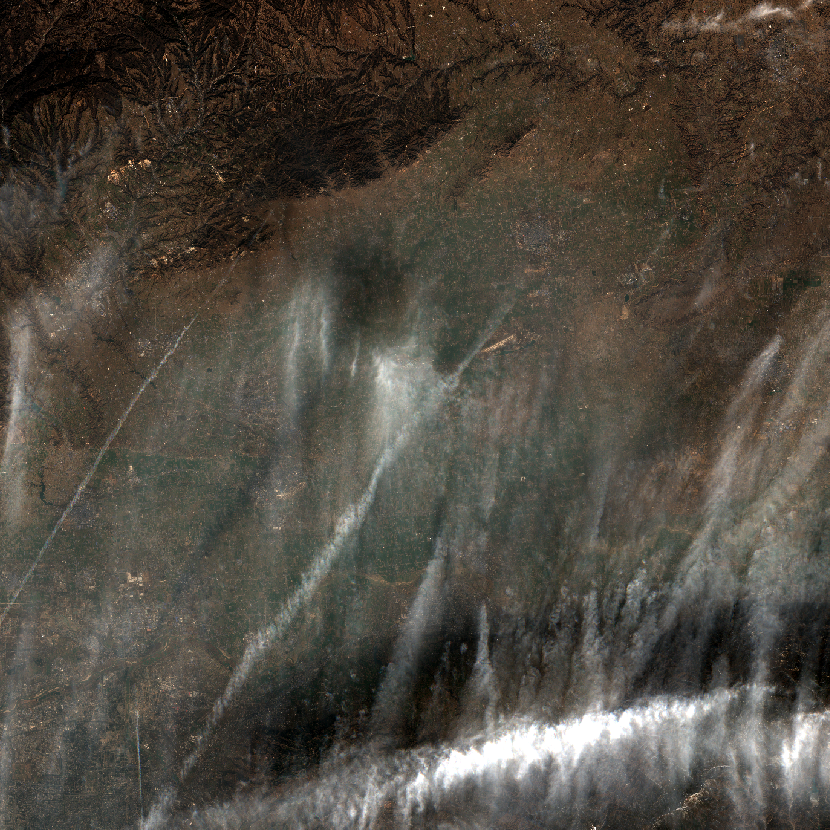

  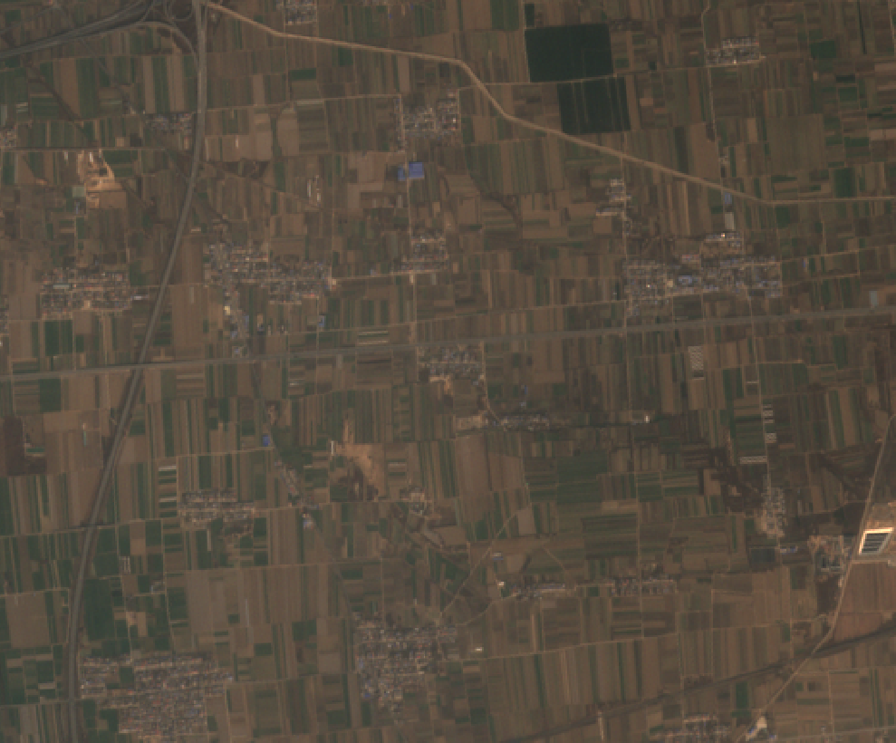

  * 通过改变代码中的子数据集以及 gdalinfo 工具查询的信息可以获取 Sentinel-2 数据集的不同波段。

# 参考文献

[1] KilllerQueen. Python脚本批量读取哨兵2号（Sentinel2）影像并另存为Geotiff格式[EB/OL]. 2021-03-10[2022-01-13]. https://blog.csdn.net/KilllerQueen/article/details/114637970.
